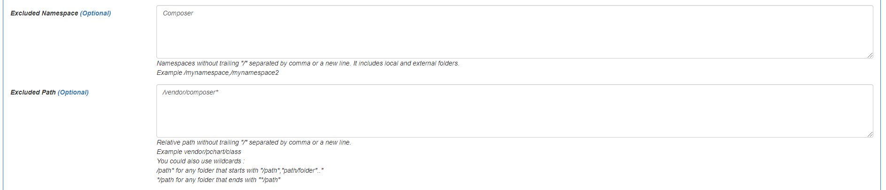

# autoloadone-example
Example code of **AutoLoadOne** Library for PHP 5.6 and higher.

The library

[https://github.com/EFTEC/autoloadone](https://github.com/EFTEC/autoloadone)

Why we need this library?

* It is a high performance library. It is optimized for speed and memory usage.
* It doesn't requires a special configuration. It works with practically every project.
* It doesn't requires a standard, PSR-0 PSR-4 or any other. And yet, it is compatible with it.

## What is an autoloader?

Let's say the next example

```php
$obj=new \example\folder\SomeClass();
```

To runs this class, we need to include it using our code.

```php
include __DIR__'/folder/SomeClass.php';
$obj=new \example\folder\SomeClass();
```

But what if the class **SomeClass** calls another class or we call more classes?.  Then we must include it manually and so on. If the include is called more than once, then the system could fail. We could avoid it using include_once but it doesn't solve all troubles.

When we use an autoloader, it loads the file only when it is required.

```php
include 'autoload.php';
$obj=new \example\folder\SomeClass();
```

Composer's Autoload uses the next strategy. It relies on composer.json to configure and creates the namespace. But it requires that our code follows a strict guideline (or two), PSR-0 or PSR-4.

```php
include 'vendor/autoloader.php';
$obj=new \example\folder\SomeClass();

```

And **composer.json**

```json
"autoload": {
  "psr-4": {
    "example\\folder\": "example/folder/",
```

However, this autoloader does the next operations:

* It includes a library. It also includes another library depending in the type of autoloader.
* It reads an array that it is loaded when **composer.json** was executed. This array has some wacky optimizations but it does some concatenations each time it is called. When is it called? Once per request of the customer!.

```php
return array(
    '7b11c4dc42b3b3023073cb14e519683c' => $vendorDir . '/ralouphie/getallheaders/src/getallheaders.php',
```

This concatenate with **$vendorDir** is executed per request x class requested. In a plain Laravel project, it is called +600 times.

* It has different strategies to call the file.

Since it is called per request, then it could hurt the performance of the system.  For example, if 1 customer call the website and he does 9 ajax calls, then he is doing 10 requests.

**AutoLoadOne** works differently. 

* First, it doesn't use any **composer.json**.
* It requires the information is compiled at least once and it stores the result in 4 variables, one for namespace => path relation, and other for namespace => filename relation.
* It consist of only 3 methods, so PHP don't need to load different php files and classes.

The information in **AutoLoadOne** is store simply, example:

```php
'example\folder' => '/folder',
```

So, it is not encoded, neither it calculates the relative folders each time. But it also has an extra optimization. It could be edited manually.

If a folder is used more than once, then it could be resumed (to save memory) as

```php
$array=[]'example\folder2\Class1' => '|1|',
'example\folder2\Class2' => '|1|'...];

// And in other array

$array=[1 => '/folder2/MultipleClasses.php'];
```

If we want to call the class example\folder2\Class1, then the system reads the second array and creates the full path with it. This conversion is only executed when the class is requested, so it doesn't harm the performance if the class is not called.  


## PSR-0

Mandatory

1. A fully-qualified namespace and class must have the following structure \<Vendor Name>\(<Namespace>\)*<Class Name>
2. Each namespace must have a top-level namespace (“Vendor Name”).
3. Each namespace can have as many sub-namespaces as it wishes.
4. Each namespace separator is converted to a DIRECTORY_SEPARATOR when loading from the file system.
5. Each _ character in the CLASS NAME is converted to a DIRECTORY_SEPARATOR. The _ character has no special meaning in the namespace.
6. The fully-qualified namespace and class are suffixed with .php when loading from the file system.
7. Alphabetic characters in vendor names, namespaces, and class names may be of any combination of lower case and upper case.

## PSR-4

1. The term “class” refers to classes, interfaces, traits, and other similar structures.

2. A fully qualified class name has the following form:

   ```
    \<NamespaceName>(\<SubNamespaceNames>)*\<ClassName>
   ```

   1. The fully qualified class name MUST have a top-level namespace name, also known as a “vendor namespace”.
   2. The fully qualified class name MAY have one or more sub-namespace names.
   3. The fully qualified class name MUST have a terminating class name.
   4. Underscores have no special meaning in any portion of the fully qualified class name.
   5. Alphabetic characters in the fully qualified class name MAY be any combination of lower case and upper case.
   6. All class names MUST be referenced in a case-sensitive fashion.

3. When loading a file that corresponds to a fully qualified class name …

   1. A contiguous series of one or more leading namespace and sub-namespace names, not including the leading namespace separator, in the fully qualified class name (a “namespace prefix”) corresponds to at least one “base directory”.
   2. The contiguous sub-namespace names after the “namespace prefix” correspond to a subdirectory within a “base directory”, in which the namespace separators represent directory separators. The subdirectory name MUST match the case of the sub-namespace names.
   3. The terminating class name corresponds to a file name ending in `.php`. The file name MUST match the case of the terminating class name.

4. Autoloader implementations MUST NOT throw exceptions, MUST NOT raise errors of any level, and SHOULD NOT return a value.

## AutoLoadOne

It works with any case, PSR-0, PSR-4, no namespaces, different folders, and even no classes.  If you are using PSR-4, it works  out of the box.


## How to start it.

### 1) Download the library or include via composer.

You can download the file AutoLoadOne.php

[https://github.com/EFTEC/autoloadone](https://github.com/EFTEC/autoloadone)

Or you can install via composer

> composer require eftec/autoloadone

This library doesn't have any dependency, so it could also  be downloaded and copied in any folder.

### 2) create the next file in the root of your project

```php
<?php

// if true then it also include files with autoloader
define('_AUTOLOAD_COMPOSERJSON',true);
// we include our library manually
include 'vendor/eftec/autoloadone/AutoLoadOne.php';
```

### 3) And runs it (as a webpage)


This code scans the folder and add the classes, interface, structs and simple PHP files and collects if there is information to store. It could take a while (depending on the size of the project). You will need to run it every time you add a new PHP file, unless you are a new class in the same folder and using the same namespace than other classes (it is what we do it anyways)

### 4) Consuming our class. 

It will generate the file called **autoload.php** and it is our autoload.

We could call it as follow.

```php
<?php
include 'autoload.php';
```

And that's it.

## How to usage?

First, this generator or autoloader doesn't requires a specific structure folder or even edit the composer.json. This library ignores composer.json.

### A simple folder and a class

📁 folder/SomeClass.php

```php
namespace example\folder;

class SomeClass
{
}
```

Let's say the next class, where the name of the class is equals than the name (**SomeClass**) of the file (**SomeClass.php**).   How we could add this class to the autoloader? If the class is inside the root folder, then it is already included.  

The library generates the next line inside autoload.php

```php
$arrautoload = [
	'example\folder' => '/folder'..]
```

It says that if we want to look at some class with the namespace example\folder, then we will look at the folder called "folder".

### A simple PHP file with multiple classes.

Why we need a file with multiple classes? Sometimes we need files that are strictly coupled because the business logic of the project or because we want to reduce the number of files of the project.

📁 folder2/MultipleClasses.php

```php
namespace example\folder2;

class Class1 {
    
}

class Class2 {
    
}
```

**AutoLoadOne** stores all classes inside this file as follow

```php
$arrautoloadCustom = [
   'example\folder2\Class1' => '/folder2/MultipleClasses.php',
   'example\folder2\Class2' => '/folder2/MultipleClasses.php'...
```

Since it is a simple file with two folders, then includes to the **autoload.php** differently than a simple class. It says, if we call the class **"example\folder2\Class1"**, then we call the file **'/folder2/MultipleClasses.php'** and so on.

### Multiple PHP files each one with one class and sharing the same folder and namespace

📁 folder3/Customer.php

```php
namespace example\erp;
class Customer
{
}
```

📁 folder3/Employees.php

```php
namespace example\erp;
class Employees
{
}
```

**AutoLoadOne** associates the namespace with the folder, so it is an efficient way to work. 

```php
$arrautoload = [
   'example\erp' => '/folder3',
```

> We don't need to run **AutoLoadOne** again if we add a new class in the same folder and in the same namespace.

### Library outside of our root folder.

In our interface visual (web), we could set many configuration, including to use a library in any other folder (relative or absolute path)


In this example, we will use a relative path.

📁 root folder <-- our root folder

📁 external project/somefolder/ClassExternal.php  <-- the class that we want to include.

**AutoLoadOne** adds a follow

```php
$arrautoload = [
   'external\somenamespace' => '../externalproject/somefolder'
```

### Adding a non-class PHP file.

It is also possible to add and execute a PHP file without classes. For this, we need to add a comment in any part of the file.

```php
/** @autorun */
```

**AutoLoadOne** adds a follow 

```php
@include __DIR__.'/noclasses/noclass.php';
```

It does a directly include to the file.

### Adding a non-class PHP file with priority.

The system also allows to include a file with priority. To do this, we need to add this comment in any part of our file

```php
/** @autorun first */
```

It is called before the regular autorun.

### Excluding namespaces and folders.

This library also allows to exclude files using folders and/or namespaces.

For example, this library founds automatically the classes of composer (that we don't want to load). We could save some ram by removing it. We could remove via folder or namespace

```php
'ComposerAutoloaderInit18396353ba4e6f59a571a2e69914dd47' => '|2|real.php',
'Composer\Autoload\ComposerStaticInit18396353ba4e6f59a571a2e69914dd47' => '|2|static.php'
```




